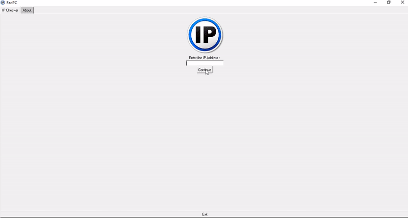

# FazIPC

An IP Checker Software/Program GUI based that is coded in Perl

## How to run ?

- Run FazIPC Setup.exe, follow the instruction
- Run FazIPC.exe from the directory (where you installed it) or from FazIPC's shortcut
- Enter IP address that you want it to be checked the information, click continue, and it will be displayed
- If you want to clear the result, just click continue again.
- If you want to copy the result, just select it and copy-paste the result to a .txt file
- If you want to check your IP address's information, just click continue without entering any IP address.

## Attention

Make sure you have a network connection for the software to work. Email me or open an issue if you find a bug or trouble with FazIPC.
